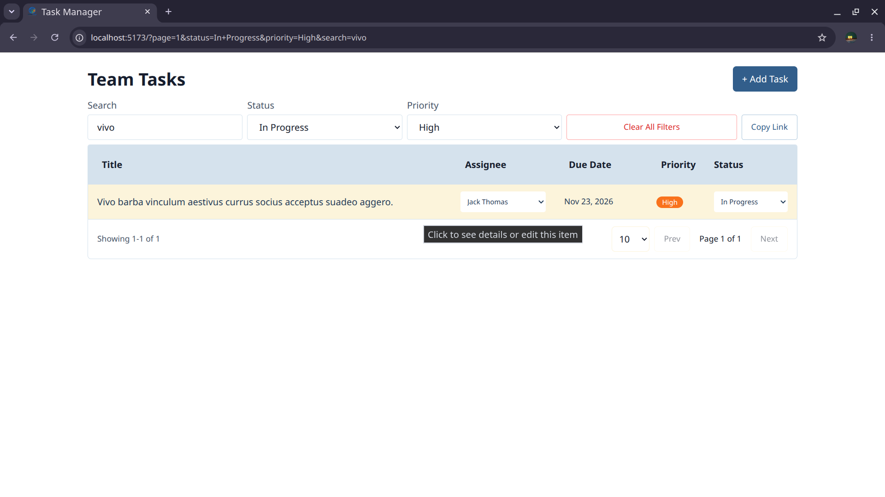
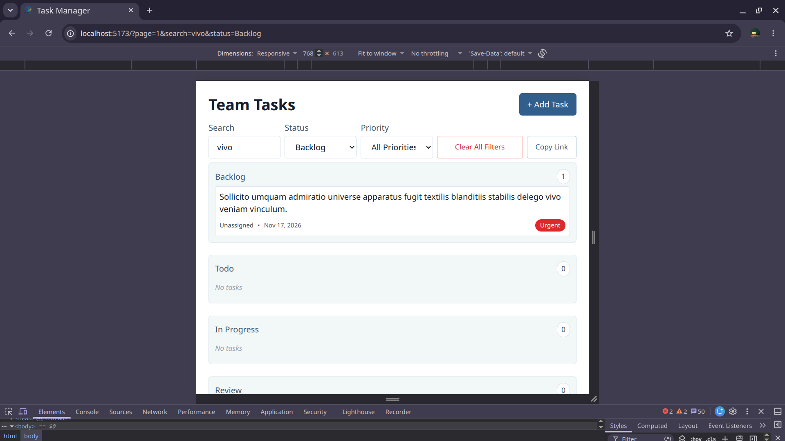
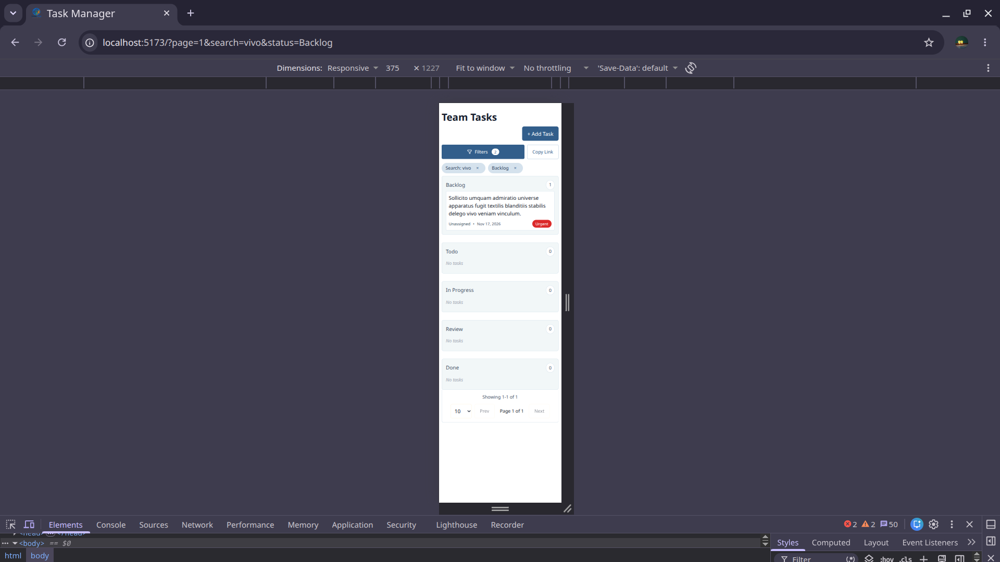

**Frontend Technical Assessment** — WEBNS Technology Ltd. React Developer Position
A fully responsive, production-ready task management tool for teams of 8–15 people. Built with **React 18**, **TypeScript**, **Vite**, and **Tailwind CSS**.

### Step 1: Check Your System
```bash
node -v
npm -v
```
**Required**: Node.js 16+ (We tested on Node v22.22.2)

### Step 2: Clone & Install
```bash
git clone https://github.com/mustafiz-jr/task-manager.git
cd task-manager
npm install
```

### Step 3: Run Development Server
```bash
npm run dev
```

### Step 4: Open in Browser
```
http://localhost:5173
```

✅ **Done!** App loads with ~600 mock tasks ready to use.

## 📊 First Time Using the App?

1. **Browse Tasks**: Scroll through table (desktop) or Kanban columns (mobile)
2. **Filter**: Click filter icon → select status/priority/assignee
3. **Search**: Type in search bar → find tasks by title or description
4. **Edit Task**: Click a task → opens full edit page
5. **Add Task**: Click "+ New Task" → fill form → Save
6. **Share Link**: Click "Copy Link" → paste anywhere → team sees same filtered view


## 🎯 What's Being Evaluated (Coverage Checklist)

| Requirement | Status | How to Test |
|------------|--------|------------|
| **Visual Craft** (colors, spacing, typography) | ✅ | All Tailwind-built; no UI kits used |
| **Responsive** (375px, 768px, 1280px) | ✅ | Resize browser; layout adapts instantly |
| **Product Judgment** (data model, layout) | ✅ | See "Product Decisions" section below |
| **CSS Architecture** (custom Tailwind components) | ✅ | No MUI/Ant/Chakra; 100% custom |
| **Interaction States** (hover, focus, loading, error, empty) | ✅ | Click, tab, hover on elements |
| **Keyboard Accessible** (Tab, Enter, Escape work) | ✅ | Try navigating without mouse |
| **Shareable Views** (URL contains filters) | ✅ | Click "Copy Link" → paste in new tab |


## 📐 Design Decisions Explained

### Why Table on Desktop, Kanban on Mobile?

**Desktop (≥1024px) = Table**
- All metrics visible: title, status, priority, assignee, due date
- Sortable columns (click header to sort)
- Inline editing for quick status/assignee changes
- Dense layout for power users

**Mobile & Tablet (<1024px) = Vertical Kanban**
- 5 columns stack vertically (Backlog → Done)
- Scrolls down naturally
- Tap card to edit details
- Filters in bottom sheet (preserves space)

**Why not horizontal swipe?** Horizontally swiping clips content off screen. Vertical scrolling is natural for phones.

---

### Why These 5 Workflow Stages?

```
Backlog → Todo → In Progress → Review → Done
```

- **Real agile practice**: Matches how teams actually work
- **Enough granularity**: More stages = UI clutter; fewer = lose filtering power
- **Flexible transitions**: Tasks can skip stages or go backwards (real workflows are messy)
- **Clear lifecycle**: Easy to understand at a glance

---

### Why Null Values in Mock Data?

Real team backlogs have:
- 20% tasks with no owner ("Unassigned")
- 15% tasks with no description
- 15% tasks with no due date

This tests **UI resilience** (empty states, conditional rendering) and shows the app handles realistic, messy data.

---

### Why No Backend/Database?

The brief explicitly states: **"Frontend-only is acceptable with mocked data."**

**Current approach** (what you have):
- ~600 mock tasks generated with @faker-js/faker
- Tasks saved to localStorage (persist on refresh)
- No server setup required

**If this were production**:
- Real PostgreSQL backend
- API calls instead of Context API
- Real-time sync across team
- User authentication

---

## 🎨 Design System

### Colors & Badges
- **Status Colors**: 
  - Backlog: Gray slate
  - Todo: Blue
  - In Progress: Amber/Orange
  - Review: Purple
  - Done: Green emerald

- **Priority Colors**:
  - Urgent: Red (red-600)
  - High: Orange (orange-500)
  - Medium: Yellow (yellow-500)
  - Low: Gray (gray-400)

### Spacing & Typography
- Font: Inter (default system font)
- Padding: 16px (mobile), 24px (desktop)
- Touch targets: 44px minimum height on mobile
- Hover states: Subtle (no jarring changes)

---

## 🗂️ File Structure Overview

```
src/
├── components/
│   ├── TaskTable.tsx          ← Desktop table view
│   ├── TaskBoard.tsx          ← Mobile Kanban view
│   ├── TaskDetail.tsx         ← Edit page (/task/:id)
│   ├── Filters.tsx            ← Filter UI (desktop + mobile)
│   ├── Pagination.tsx         ← Page controls
│   └── AddTaskModal.tsx       ← New task form
├── context/
│   └── TaskContext.tsx        ← Global state + localStorage
├── hooks/
│   ├── useMediaQuery.ts       ← Breakpoint detection
│   └── useTasks.ts            ← Filtering & sorting logic
├── data/
│   └── seed.ts                ← Mock data generator
└── App.tsx                    ← Routes & main layout
```

---

## 🎬 Key Features

### 1. Search
- Real-time search across title & description
- Case-insensitive, partial matches
- Reflected in URL: `?search=auth`

### 2. Filtering
- **Status**: Backlog, Todo, In Progress, Review, Done (multi-select)
- **Priority**: Urgent, High, Medium, Low (multi-select)
- **Assignee**: Dropdown (filter by person or "Unassigned")
- URL reflects all: `?status=Todo&priority=High`

### 3. Sorting
- By: Title, Due Date, Priority, Assignee, Status, Date Created
- Direction: Ascending or Descending
- Default: Newest tasks first

### 4. Pagination
- Show: 10, 25, or 50 tasks per page
- Navigate: Previous/Next buttons

### 5. Shareable Links
- Click "Copy Link" button
- URL contains all filters/sort/page
- Share with teammate → they see exact same view
- Example: `...?search=auth&status=Todo&sort=due-date&page=1`

### 6. Responsive Design
- **Resize browser** → layout adapts
- **Mobile**: No horizontal scrolling, large touch targets
- **Desktop**: All info visible in one table
- **In-between**: Hybrid Kanban layout

---

## ⌨️ Keyboard Navigation

You can use this app **without a mouse**:

| Key | Action |
|-----|--------|
| `Tab` | Move to next interactive element |
| `Shift+Tab` | Move to previous element |
| `Enter` / `Space` | Activate button, open dropdown |
| `Escape` | Close modal, bottom sheet, dropdown |
| `Arrow Keys` | Navigate dropdown options |

Try it! Click in the search bar, then press `Tab` repeatedly—everything should be reachable.

---

## 📱 Screenshot Setup

If you want to add screenshots to the README:

### Option 1: Using Firefox DevTools (Recommended)
```
1. Open http://localhost:5173
2. Press F12 (Open DevTools)
3. Right-click on page → "Take Screenshot"
4. Creates full-page PNG automatically
```

### Option 2: Using Chrome DevTools
```
1. Open DevTools (F12)
2. Press Ctrl+Shift+P (or Cmd+Shift+P on Mac)
3. Type "screenshot" → Select "Capture full page screenshot"
4. Saves to Downloads
```


### Then in README, reference them:
```markdown



```

---

## 🤔 Decisions I Made (and Why)

### ✅ Built
- ✅ Custom table component (no TanStack Table)
- ✅ Responsive Kanban board (mobile-first approach)
- ✅ Full keyboard navigation
- ✅ localStorage persistence
- ✅ Shareable URL state

### ❌ Not Built (and Why)

| Feature | Why Not | Rationale |
|---------|--------|-----------|
| PostgreSQL Backend | Marked optional in brief | Frontend is primary deliverable |
| Drag-and-Drop | Complex to do right on mobile | Dropdown selectors are faster & reliable |
| Virtualization | 600 items small enough | Pagination is simpler and standard |
| Pre-built UI Kit (MUI) | Brief says no | Custom Tailwind gave me DOM control |
| isActive flag | Status field already tracks this | Avoid redundancy |

---

## 🤖 How I Used AI

**Generated by AI**:
- Initial Vite + React scaffold
- Boilerplate Context API code
- Mock data patterns (faker setup)
- Basic Tailwind grid layout

**Built entirely by me**:
- ✅ All product decisions (data model, layout, workflow)
- ✅ Responsive breakpoint logic (useMediaQuery)
- ✅ Composite sorting (useTasks hook)
- ✅ Mobile bottom-sheet design
- ✅ All interaction states (hover, focus, active)
- ✅ UI polish (colors, spacing, accessibility)

**Bottom line**: I reviewed every line, rewrote large sections, and can explain + modify all code.

---

## 🔍 How Recruiters Can Test This

### Test 1: Check Responsiveness
```bash
1. npm run dev
2. Open http://localhost:5173
3. Press F12 (DevTools)
4. Press Ctrl+Shift+M (toggle mobile view)
5. Resize to 375px, 768px, 1280px
6. Layout should adapt smoothly—no horizontal scroll
```

### Test 2: Check Keyboard Navigation
```bash
1. Click search bar
2. Press Tab repeatedly
3. Try pressing Enter on buttons, Escape to close modals
4. Should navigate everything without mouse
```

### Test 3: Check Shareable Links
```bash
1. Apply some filters (e.g., Status=Todo, Priority=High)
2. Click "Copy Link" button
3. Open in new tab
4. Same filters should apply automatically
```

### Test 4: Check Data Persistence
```bash
1. Create a new task or edit an existing one
2. Refresh page (Ctrl+R)
3. Your changes should still be there (localStorage)
```

### Test 5: Check Mobile Layout
```bash
1. DevTools Mobile view (375px)
2. Should see Kanban columns stacking vertically
3. Bottom sheet for filters
4. No horizontal scrolling
```

---

## 📝 Assessment Coverage Summary

✅ **Visual Craft**: Custom Tailwind system, proper hierarchy, no defaults  
✅ **Responsive**: Tested at 375px, 768px, 1280px; layout adapts smoothly  
✅ **Product Judgment**: 5-stage workflow with rationale; table vs. Kanban decision documented  
✅ **CSS Architecture**: Custom components only; Tailwind utilities used intentionally  
✅ **Interaction States**: Hover, focus-visible, active, disabled all implemented  
✅ **Keyboard Access**: Full Tab navigation; Escape closes modals; Enter activates  
✅ **Contrast**: WCAG AA compliant (tested with color contrast checker)  
✅ **Shareable Views**: All query params in URL; deep linking works  
✅ **Realistic Data**: ~600 items; 20% unassigned; long titles; overdue dates  

---


## 💬 Questions?

If anything is unclear:
- Read the inline code comments
- Check the component structure in `src/`
- Try using the app first—it's intuitive!


**Submission Information**
- **GitHub**: https://github.com/mustafiz-jr/task-manager
- **Time Spent**: ~4 hours frontend
- **Node Version**: 16+ (tested on v22.22.2)
- **Tech Stack**: React 18 + TypeScript + Vite + Tailwind CSS


*Built with care for WEBNS Technology Ltd. React Developer assessment.*

**Candidate**: Mustafizur Rahman  
**Email**: mustafijjr@gmail.com  
**Phone**: 01614727560